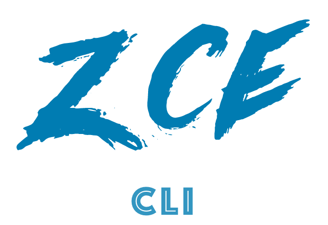

<p align="center">
  <a href="https://github.com/zce/zce-cli"></a>
  <p>A CLI tool for my personal productivity, inspired by gluegun &amp; metalsmith &amp; vue-cli &amp; yeoman &amp; etc.</p>
  <p>
    [![Actions Status][actions-img]][actions-url]
    [![Build Status][travis-img]][travis-url]
    [![Coverage Status][codecov-img]][codecov-url]
    <br>
    [![NPM Downloads][downloads-img]][downloads-url]
    [![NPM Version][version-img]][version-url]
    [![License][license-img]][license-url]
    [![Dependency Status][dependency-img]][dependency-url]
    [![devDependency Status][devdependency-img]][devdependency-url]
    [![Code Style][style-img]][style-url]
    <br>
  </p>
</p>

## Installation

```sh
# install it globally
$ npm install -g zce-cli

# or yarn
$ yarn global add zce-cli
```

## Usage

### init

> Simple scaffolding for generate project. [How to work](doc/how-to-work.md).

```sh
# generate a new project from a template
$ zce init <template-name> [my-project] [-o|--offline] [-f|--force] [-s|--save]
```

#### Options

- `-f, --force`: overwrite target directory if it exists
- `-o, --offline`: offline mode, use cached template
- `-s, --save`: save the answers for the next
- `-h, --help`: output usage information

#### Example

##### Use github repo template

```sh
$ zce init nm my-module
```

The above command pulls the template from [zce-templates/nm](https://github.com/zce-templates/nm), then ask some questions, and generate the project at `./my-module`.

##### Use local template

Instead of a GitHub repo, you can also use a template on your local file system, e.g.

```sh
$ zce init ~/local/foo my-foo
```

The above command use the template from `~/local/foo`, then ask some questions, and generates the project at `./my-foo`.

### list

```sh
# list available official templates
$ zce list [-s|--short] [-j|--json]
```

#### Options

- `-s, --short`: short list display
- `-json, --json`: json mode output
- `-h, --help`: output usage information

### Official Templates

Current available templates list:

- [ ] [template](https://github.com/zce-templates/template) - Templates template
- [ ] [nm](https://github.com/zce-templates/nm) - Node module boilerplate
- [ ] [webapp](https://github.com/zce-templates/webapp) - :construction: Modern web app
- [ ] [react](https://github.com/zce-templates/react) - :construction: Modern web app by React.js
- [ ] [vue](https://github.com/zce-templates/vue) - :construction: Modern web app by Vue.js
- [ ] [jekyll](https://github.com/zce-templates/jekyll) - :construction: Static site by Jekyll
- [ ] [electron](https://github.com/zce-templates/electron) - :construction: Electron app
- [ ] [x-pages](https://github.com/zce-templates/x-pages) - :construction: Static site by x-pages

Maybe more: https://github.com/zce-templates

> You can also run `zce list` to see all available [official templates](doc/official-templates.md) in real time.

### Create Your Template

To create and distribute your own template, refer to [Create new template](doc/create-template.md).

> Maybe fork an official template or use [zce-templates/template](https://github.com/zce-templates/template) is a better decision.

### serve (WIP)

> Simple static site develop workflow.

:construction:

### Maybe more...

## Todos

- [x] CLI Frameworks
- [x] Generate list command
- [x] Generate init command
- [ ] Refactor templates
- [ ] Generate command test
- [ ] Integration test
- [ ] Docs
- [ ] Extract core into package

## Issues

- Re-exports in typescript
  ```javascript
  // https://stackoverflow.com/questions/55753163/package-json-is-not-under-rootdir#61467483
  // https://github.com/microsoft/TypeScript/issues/2726
  // export { default as rimraf } from 'rimraf'
  // export { default as mkdirp } from 'mkdirp'
  // export { default as tildify } from 'tildify'
  // export { default as untildify } from 'untildify'
  ```
- lazy-import

## Contributing

1. **Fork** it on GitHub!
2. **Clone** the fork to your own machine.
3. **Checkout** your feature branch: `git checkout -b my-awesome-feature`
4. **Commit** your changes to your own branch: `git commit -am 'Add some feature'`
5. **Push** your work back up to your fork: `git push -u origin my-awesome-feature`
6. Submit a **Pull Request** so that we can review your changes.

> **NOTE**: Be sure to merge the latest from "upstream" before making a pull request!

## License

[MIT](LICENSE) &copy; [汪磊](https://zce.me)

[actions-img]: https://github.com/zce/zce-cli/workflows/CI/badge.svg
[actions-url]: https://github.com/zce/zce-cli/actions
[travis-img]: https://img.shields.io/travis/zce/zce-cli.svg
[travis-url]: https://travis-ci.org/zce/zce-cli
[codecov-img]: https://img.shields.io/codecov/c/github/zce/zce-cli.svg
[codecov-url]: https://codecov.io/gh/zce/zce-cli
[downloads-img]: https://img.shields.io/npm/dm/zce-cli.svg
[downloads-url]: https://npmjs.org/package/zce-cli
[version-img]: https://img.shields.io/npm/v/zce-cli.svg
[version-url]: https://npmjs.org/package/zce-cli
[license-img]: https://img.shields.io/github/license/zce/zce-cli.svg
[license-url]: https://github.com/zce/zce-cli/blob/master/LICENSE
[dependency-img]: https://img.shields.io/david/zce/zce-cli.svg
[dependency-url]: https://david-dm.org/zce/zce-cli
[devdependency-img]: https://img.shields.io/david/dev/zce/zce-cli.svg
[devdependency-url]: https://david-dm.org/zce/zce-cli?type=dev
[style-img]: https://img.shields.io/badge/code%20style-standard-brightgreen.svg
[style-url]: https://standardjs.com
